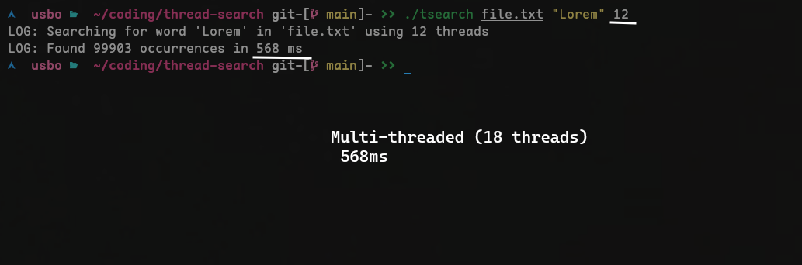

# TSEARCH

This **educational repository** shows how effective threads are when **searching for words** in long texts.

> [!WARNING]  
> This program is made using pthread for syscalls, so It works only on POSIX systems (Linux, MacOS, ...)

## Proofs

We can immediately prove that **multi-threading** allows us to obtain significanly better performances for example using the tool on a file and search for a word with many occurrences such as *Lorem* in this case.

- Starting the software with **only one thread** running will take about *1 second* on my machine. 

- Instead, by launching the software using **12 threads** we see a clear increase in performance, in fact the time has halved from *1094ms* to *598ms*. 

## Compilation:

1. Clone the repo `git clone https://github.com/UsboKirishima/thread-search.git tsearch && cd tsearch`

2. Run `make`

3. Start with `./tsearch <filename> <word> <num_threads>`
